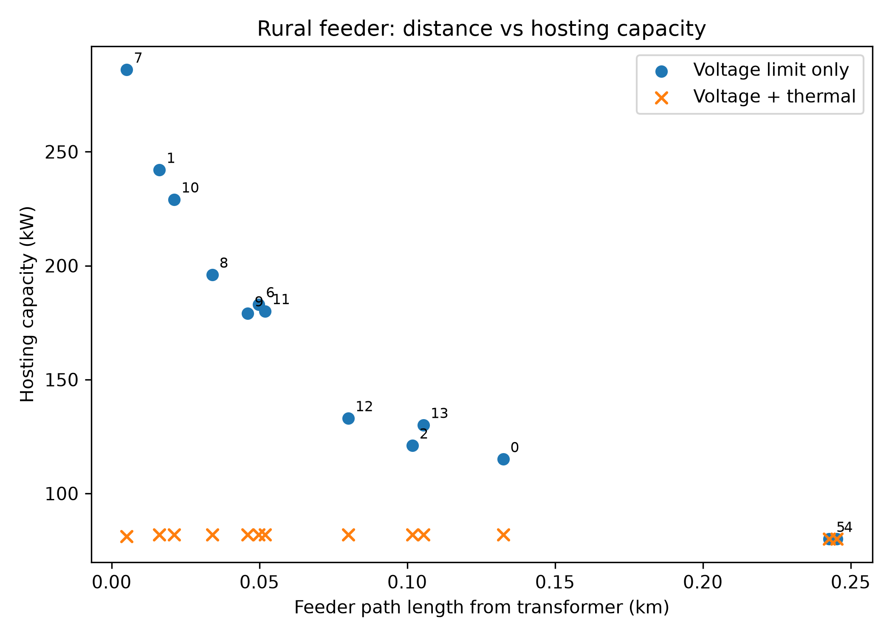
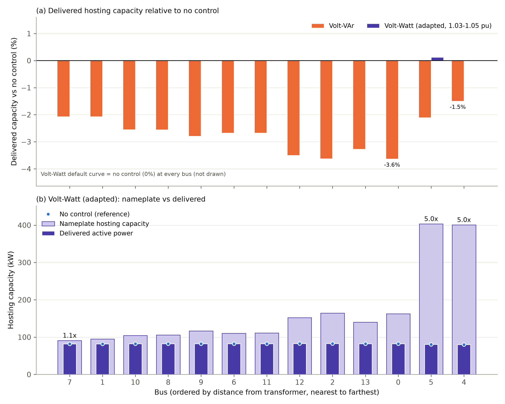
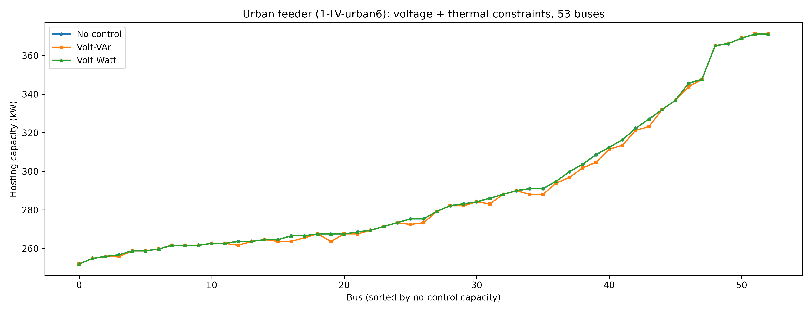

# PV Hosting Capacity of Real Low-Voltage Feeders Under Combined Voltage and Thermal Constraints:
# Do Standard Volt-VAr and Volt-Watt Curves Increase Deliverable Capacity?

## Abstract
Rising residential PV adoption is constrained by distribution network
hosting capacity (HC). Smart-inverter functions such as Volt-VAr and
Volt-Watt control (IEEE 1547-2018) are widely proposed to raise HC, but
most studies evaluate them under voltage constraints alone. This study
quantifies HC in kW on two real German low-voltage feeders from the
SimBench dataset (rural: 15 buses, 160 kVA transformer; urban: 53 load
buses, 630 kVA transformer) under combined voltage (1.05 pu) and thermal
(line and transformer loading ≤ 100%) constraints, using pandapower and a
binary search with 0.1 kW tolerance. Without control, HC ranges from
80.1 to 82.7 kW on the rural feeder (transformer-bound) and from 252.5 to
371.8 kW on the urban feeder (line-bound). The IEEE 1547-2018 default
Volt-VAr curve reduces HC at every rural bus (by 1.5–3.6%) and at 27 of 53
urban buses (by up to 1.5%), never increasing it. A direct measurement
at the rural transformer shows the cause: for the same PV size, Volt-VAr
leaves the active power flow unchanged but increases the reactive power
supplied through the transformer by 6.6–14.8 kvar, which pushes its
loading above 100%. The default Volt-Watt
curve is never activated before a thermal limit is reached and is
identical to no control at every bus of both feeders. A Volt-Watt curve
tuned to start curtailing at 1.03 pu raises nameplate HC (up to 403.5 kW
rural, 568.7 kW urban), but the active power actually delivered remains
within 0.1 kW of the uncontrolled value. These results show that when a
thermal limit binds, standard local voltage-control curves cannot raise
deliverable PV capacity, and that reporting nameplate rather than
delivered power can overstate HC by up to a factor of five.

## 1. Introduction

Increasing penetration of rooftop photovoltaic (PV) systems in low-voltage
(LV) distribution networks is often constrained by voltage rise, a
phenomenon extensively studied under the term "hosting capacity" (HC).
Smart inverter functions — particularly Volt-VAr and Volt-Watt control
per IEEE 1547-2018 — have been proposed to mitigate this constraint.

However, in the studies reviewed here, control strategies are mostly
evaluated under voltage constraints alone. For example, Alfouly et al.
(2025) use simplified single-feeder test systems and do not quantify
hosting capacity in kW or consider thermal loading of network equipment.
Transformer thermal limitations have been independently recognized as a
critical HC constraint: Ame-Oko and Lavrova (2024) address this via
battery storage dispatch, while Qamar et al. (2023), in a comprehensive
review, note that DSOs in several countries (e.g., Portugal <25%, Spain
<50% and Italy <65% of the MV/LV transformer rating) impose hard limits
on DG capacity as a fraction of transformer rating, confirming the
practical relevance of this constraint. Dissanayake et al. (2022)
combine voltage control with dynamic line rating on a real Sri Lankan
network but test only a single 25-node topology. Chathurangi et al.
(2021) compare Volt-VAr and Volt-Watt performance across feeder types but
do not examine the interaction between reactive power support and
transformer thermal limits.

To the best of our knowledge, and within the literature reviewed, none of
these studies directly compares Volt-VAr and Volt-Watt control under
simultaneous voltage and thermal constraints across multiple real network
topologies. This study addresses that gap. Its contributions are:

1. Hosting capacity quantified in kW, bus by bus, on two real LV feeders
   (rural and urban) under combined voltage and thermal constraints.
2. Evidence that, once a thermal limit binds, the IEEE 1547-2018 default
   Volt-VAr curve does not raise HC (it slightly lowers it) and the
   default Volt-Watt curve is inactive.
3. A distinction between *nameplate* HC (installed PV size) and
   *delivered* HC (active power actually injected), showing that a
   tuned Volt-Watt curve raises the former but not the latter.
4. A demonstration that the binding constraint is topology-dependent
   (transformer on the rural feeder, line on the urban feeder).
5. A direct measurement of the transformer's active power, reactive
   power and apparent power with and without Volt-VAr, identifying why
   Volt-VAr lowers capacity on the rural feeder.

## 2. Methodology

### 2.1 Network Models and Operating Point
The study uses the SimBench dataset (Meinecke et al., 2020; University of
Kassel, Fraunhofer IEE, RWTH Aachen, TU Dortmund). Unlike standard
synthetic test systems (e.g., IEEE 33-bus), SimBench networks are derived
from real German DSO planning principles. Power flow uses pandapower's
Newton-Raphson solver (Thurner et al., 2018).

| Feeder | SimBench code | Transformer | Loads | Existing PV | Base trafo loading |
|---|---|---|---|---|---|
| Rural | `1-LV-rural1--0-sw` | 160 kVA | 13 loads, 80 kW | 4 units, 160.4 kW | 52.5% (net export 78.9 kW) |
| Urban | `1-LV-urban6--0-sw` | 630 kVA | 111 loads at 53 load buses, 441 kW | 5 units, 57.1 kW | 67.7% (net import 392.2 kW) |

All values are those stored in the SimBench network files (the slack
voltage is 1.025 pu). The analysis is a single deterministic snapshot:
loads and the existing PV units are taken at their stored values, and the
SimBench time-series and study-case scaling factors are not applied.
Hosting capacity is therefore the **additional** PV that can be connected
at one load bus on top of the existing generation in this snapshot.

### 2.2 Constraints
- **Voltage:** maximum bus voltage ≤ 1.05 pu. This is a conservative
  planning limit, not the EN 50160 limit: EN 50160 permits ±10% of
  nominal voltage at LV. A limit of 1.10 pu is therefore also evaluated
  as a sensitivity case. Only the upper limit is enforced, since PV
  injection raises voltages.
- **Thermal:** line loading (`res_line.loading_percent`) and transformer
  loading (`res_trafo.loading_percent`) ≤ 100%. Both are current-based
  (pandapower default `trafo_loading="current"`): the transformer loading
  is the larger of the HV and LV currents relative to the rated current.
  Because I = S / (√3 · V), at the LV voltage of about 1.03 pu found at
  the capacity limit, a loading of 100% corresponds to an apparent power
  of about 103% of the rated value.

A candidate PV size is feasible only if all constraints hold
simultaneously.

### 2.3 Hosting Capacity Definitions and Search
For each load bus, a PV generator (sgen) is added and its size increased
until a constraint is violated. Two quantities are reported:

- **Nameplate HC:** the largest installed PV size that is feasible.
- **Delivered HC:** the active power actually injected at that size after
  any curtailment by the control function.

Without curtailment the two are equal. Feasibility is assumed to be
monotonic in PV size, so the largest feasible size is found by binary
search with 0.1 kW tolerance (upper bound 2000 kW on both feeders), about
15 search steps per bus and scenario (log2(2000/0.1) ≈ 14.3). An initial linear
search (1 kW steps) was replaced because it was computationally expensive
and, with a fixed upper bound, returned the bound itself where no
constraint was violated. The distance from each bus to the transformer
was computed with pandapower's `calc_distance_to_bus`, which returns the
path length in km. Since all lines on the rural feeder are the same cable
type (NAYY 4x150SE), path length is a valid proxy for electrical distance
there.

### 2.4 Control Scenarios
Only the added PV unit is controlled; the existing PV units are
uncontrolled. Reactive power is expressed per unit of the PV nameplate,
and no inverter apparent-power limit is imposed (S reaches up to about
1.09 times the nameplate under Volt-VAr).

| Scenario | Description |
|---|---|
| NC | No control (unity power factor) |
| VVAR | IEEE 1547-2018 default Volt-VAr curve |
| VW default | IEEE 1547-2018 default Volt-Watt curve |
| VW adapted | Volt-Watt curve starting earlier, at 1.03 pu |

**Volt-VAr.** Voltage breakpoints V1=0.92, V2=0.98, V3=1.02, V4=1.08 pu
with reactive power ratios Q1=+0.44, Q2=Q3=0, Q4=−0.44 of nameplate.
Voltage and reactive power are mutually dependent, so each power flow is
solved iteratively (up to 20 iterations, convergence when Q changes by
less than 0.1 kvar). A candidate that does not converge is treated as
infeasible.

**Volt-Watt.** Active power ratio falls linearly from 1.0 at VW1 to 0.2 at
VW2. Default: VW1=1.06, VW2=1.10 pu. Adapted: VW1=1.03, VW2=1.05 pu.
The delivered power is the equilibrium of P = P_nameplate · r(V(P)), found
by bisection. Because voltage increases with injected power and r is
non-increasing in voltage, the residual is strictly decreasing in P, so
the equilibrium is unique (for a radial feeder with a single controlled
injection). An earlier damped fixed-point iteration (α=0.3) was replaced
by this deterministic solution because plain iteration oscillates between
full output and 20% output.

### 2.5 Mathematical Formulation

**Power flow.** For each bus i, the AC power balance solved by
Newton-Raphson is:

    P_i = V_i * Σ_k V_k * (G_ik*cos(θ_ik) + B_ik*sin(θ_ik))
    Q_i = V_i * Σ_k V_k * (G_ik*sin(θ_ik) - B_ik*cos(θ_ik))

where V_i is voltage magnitude, θ_ik the voltage angle difference between
buses i and k, and G_ik, B_ik the real and imaginary parts of the bus
admittance matrix.

**Hosting capacity.** For each bus b, with the added PV of nameplate P_n:

    HC_b = max P_n
    subject to:
      V_j ≤ V_max,          ∀ buses j       (V_max = 1.05 pu; 1.10 sensitivity)
      I_l / I_max,l ≤ 1,    ∀ lines l
      I_t / I_rated,t ≤ 1,  ∀ transformers t,   I_t = max(I_HV, I_LV)

The delivered capacity is P_del = P_n · r(V_b(P_del)), with r ≡ 1 for NC
and VVAR.

**Volt-VAr law** (piecewise linear, per unit of nameplate):

    Q(V) = Q1,                                 V ≤ V1
    Q(V) = Q1 + (Q2-Q1)(V-V1)/(V2-V1),         V1 < V ≤ V2
    Q(V) = Q2,                                 V2 < V ≤ V3
    Q(V) = Q3 + (Q4-Q3)(V-V3)/(V4-V3),         V3 < V ≤ V4
    Q(V) = Q4,                                 V > V4

with (V1..V4) = (0.92, 0.98, 1.02, 1.08) and (Q1..Q4) = (+0.44, 0, 0, −0.44).

**Volt-Watt law:**

    r(V) = 1,                                    V ≤ VW1
    r(V) = 1 + (PW2-1)(V-VW1)/(VW2-VW1),         VW1 < V < VW2
    r(V) = PW2 = 0.2,                            V ≥ VW2

**Transformer current and apparent power.** The transformer loading is
current-based, and the current is I = S / (√3 · V) with
S = √(P² + Q²). For a fixed active power flow P and voltage V, any
non-zero reactive flow Q raises S and therefore the current and the
loading. Reactive absorption by the inverter changes the Q drawn through
the transformer, which is the mechanism measured in Section 3.6.

## 3. Results

### 3.1 Voltage-Only Baseline (Rural)
With only the 1.05 pu limit, HC ranged from 80 kW (buses 4 and 5) to
286 kW (bus 7). Capacity was strongly and negatively rank-correlated with
the path distance from the transformer (Spearman ρ = −0.98, n = 13;
Figure 3): the farthest buses (0.24 km) host the least, the nearest
(0.005 km) the most.

### 3.2 Rural Feeder Under Voltage and Thermal Constraints
Adding the thermal limits changes the picture. The shared 160 kVA
transformer, already at 52.5% loading in the base case because of the
existing 160.4 kW of PV, becomes the binding constraint, and bus-level HC
collapses to a narrow band independent of distance (Table 1).

**Table 1.** Rural feeder hosting capacity (kW). Volt-VAr results are
identical at the 1.05 and 1.10 pu limits, and Volt-Watt default equals
No control at both limits, so they are listed once.

| Bus | No control (1.05) | No control (1.10) | Volt-VAr | Volt-Watt adapted, nameplate | Volt-Watt adapted, delivered |
|---|---|---|---|---|---|
| 0 | 82.5 | 82.5 | 79.5 | 162.7 | 82.5 |
| 1 | 82.0 | 82.0 | 80.3 | 94.8 | 82.0 |
| 2 | 82.7 | 82.7 | 79.7 | 164.2 | 82.7 |
| 4 | 80.1 | 83.1 | 78.9 | 400.8 | 80.1 |
| 5 | 80.6 | 83.0 | 78.9 | 403.5 | 80.7 |
| 6 | 82.3 | 82.3 | 80.1 | 110.5 | 82.3 |
| 7 | 82.0 | 82.0 | 80.3 | 91.1 | 82.0 |
| 8 | 82.2 | 82.2 | 80.1 | 105.7 | 82.2 |
| 9 | 82.4 | 82.4 | 80.1 | 116.7 | 82.4 |
| 10 | 82.3 | 82.3 | 80.2 | 104.6 | 82.3 |
| 11 | 82.3 | 82.3 | 80.1 | 111.2 | 82.3 |
| 12 | 82.7 | 82.7 | 79.8 | 152.1 | 82.7 |
| 13 | 82.5 | 82.5 | 79.8 | 140.0 | 82.5 |

Without control, HC is 80.1–82.7 kW at 1.05 pu and 82.0–83.1 kW at
1.10 pu. Only buses 4 and 5, the farthest from the transformer, are
voltage-bound at 1.05 pu (80.1 and 80.6 kW, against 83.1 and 83.0 kW at
1.10 pu). At every other bus the result is the same for both voltage
limits, so the transformer is the binding constraint.

### 3.3 Volt-VAr Control (Rural)
Volt-VAr reduces HC at all 13 buses relative to no control at 1.05 pu:
by 1.5% (bus 4) to 3.6% (buses 0 and 2), with a mean reduction of 2.7%.
Against the 1.10 pu reference, the reduction at buses 4 and 5 reaches
5.1%. The Volt-VAr result is identical at the 1.05 and 1.10 pu limits,
which shows that it is the thermal limit, not voltage, that bounds
Volt-VAr at every bus.

### 3.4 Volt-Watt Control (Rural)
The default Volt-Watt curve (1.06–1.10 pu) gives exactly the
uncontrolled result at every bus and at both voltage limits. Its
activation voltage (1.06 pu) lies above the 1.05 pu planning limit, and
the thermal limit is reached before voltage rises that far, so the curve
is never exercised within the feasible region.

The adapted curve (1.03–1.05 pu) does activate. It raises nameplate HC
to between 91.1 kW (bus 7) and 403.5 kW (bus 5), with the largest values
at the buses farthest from the transformer. The delivered active power,
however, differs from the uncontrolled value by at most 0.1 kW (bus 5),
i.e. the transformer ceiling is unchanged. At buses 4 and 5, nameplate
HC is 5.0 times the delivered power (400.8 kW against 80.1 kW),
because the inverter operates at the 20% floor of the curve: roughly
80% of the installed capacity is curtailed.

### 3.5 Urban Feeder
On the urban feeder (53 load buses), the no-control HC ranges from
252.5 to 371.8 kW (median 275.8 kW). The result is identical at the 1.05
and 1.10 pu limits, so voltage never binds. At the critical bus the
transformer reaches only 35.7% loading while the most loaded line reaches
99.8%: the binding constraint is the line, not the transformer. HC
therefore varies widely by bus rather than collapsing to a narrow band.

**Table 2.** Urban feeder hosting capacity (kW), minimum / median /
maximum over 53 buses. Results are identical at 1.05 and 1.10 pu.

| Scenario | Nameplate | Delivered |
|---|---|---|
| No control | 252.5 / 275.8 / 371.8 | 252.5 / 275.8 / 371.8 |
| Volt-VAr | 252.5 / 274.0 / 371.8 | 252.5 / 274.0 / 371.8 |
| Volt-Watt default | 252.5 / 275.8 / 371.8 | 252.5 / 275.8 / 371.8 |
| Volt-Watt adapted | 252.5 / 285.1 / 568.7 | 252.5 / 275.8 / 371.8 |

The pattern matches the rural feeder. Volt-VAr is lower than no control
at 27 of 53 buses (by up to 1.5%, at bus 17), equal at 26, and higher at
none. Volt-Watt default equals no control at all 53 buses. Volt-Watt
adapted raises nameplate HC at 9 buses (up to 568.7 kW, 2.12 times the
uncontrolled value at bus 17), yet delivered power stays within ±0.1 kW
of the uncontrolled value at every bus.

### 3.6 Transformer P, Q and S with Volt-VAr (Rural)
The apparent-power explanation for the Volt-VAr reduction was tested by
measuring the flows at the LV terminal of the transformer (script 10,
`results/trafo_pqs_rural.csv`). Three cases were evaluated at each of the
13 buses: (A) no control at its own capacity limit; (B) Volt-VAr with the
same PV size as in A; (C) Volt-VAr at its own capacity limit. Signs follow
the load reference at the LV terminal: positive P is export towards the
grid, and negative Q is reactive power supplied by the transformer to the
LV network.

**Table 3.** Transformer flows at three rural buses: bus 0 (large effect),
bus 4 (voltage-bound at 1.05 pu) and bus 7 (small effect).

| Bus | Case | PV size (kW) | PV Q (kvar) | Trafo P (kW) | Trafo Q (kvar) | Trafo S (kVA) | Trafo loading (%) |
|---|---|---|---|---|---|---|---|
| 0 | A: NC at its limit | 82.5 | 0.0 | 161.86 | −31.99 | 165.00 | 99.98 |
| 0 | B: VVAR, same size | 82.5 | −11.46 | 161.82 | −43.47 | 167.55 | 101.79 |
| 0 | C: VVAR at its limit | 79.5 | −10.75 | 158.88 | −42.73 | 164.53 | 99.96 |
| 4 | A: NC at its limit | 80.1 | 0.0 | 158.98 | −32.18 | 162.20 | 98.32 |
| 4 | B: VVAR, same size | 80.1 | −14.65 | 158.83 | −46.88 | 165.60 | 100.71 |
| 4 | C: VVAR at its limit | 78.9 | −14.25 | 157.68 | −46.46 | 164.38 | 99.96 |
| 7 | A: NC at its limit | 82.0 | 0.0 | 161.95 | −31.76 | 165.04 | 100.00 |
| 7 | B: VVAR, same size | 82.0 | −6.59 | 161.95 | −38.36 | 166.43 | 100.99 |
| 7 | C: VVAR at its limit | 80.3 | −6.40 | 160.25 | −38.16 | 164.73 | 99.97 |

Over the 13 buses, switching Volt-VAr on at the same PV size (A to B)
leaves the active power through the transformer practically unchanged
(change 0.0 to −0.15 kW) but raises the reactive power supplied by the
transformer by 6.6–14.8 kvar, on top of the roughly 32 kvar it already
supplies without control. S rises by 1.4–3.4 kVA and the transformer
loading rises from 98.3–100.0% to 100.7–101.8%, so the no-control
capacity is infeasible with Volt-VAr at all 13 buses. At the Volt-VAr
capacity limit (C) the loading is back at 100%, with 1.2–3.0 kW less PV
than in A. Because the loading is current-based, S at the thermal limit is
about 103% of the rated apparent power (the LV voltage is about 1.03 pu).

## 4. Discussion

**The binding constraint decides whether voltage control matters.** On
both feeders the thermal limit is reached before the voltage limit
(except at the two most remote rural buses, by 3 kW or less). Local
voltage-control curves act on voltage; they cannot move a thermal
ceiling. This explains why neither standard curve raises deliverable
capacity on either feeder, in spite of the different topology and the
different binding element (transformer versus line).

**Volt-VAr can reduce capacity.** On the rural feeder the reduction of
1.5–3.6% has a measured cause (Section 3.6). The transformer already
supplies about 32 kvar to the LV network (load reactive power and cable
reactance). When the Volt-VAr inverter absorbs reactive power at high
voltage, the additional reactive power is drawn through the same
transformer in the same direction. The active power flow is unchanged, so
S = √(P² + Q²) and the current increase, and the 100% limit is reached at
a smaller PV size. The effect depends on the direction of the existing
reactive flow: where the transformer carries reactive power in the
opposite direction, absorption would reduce the current instead. Rural
Volt-VAr HC is also the same at 1.05 and 1.10 pu, i.e. thermally bound at
every bus. On the urban feeder (reduction of up to 1.5%, line-bound) the
flows were not measured; the same mechanism is plausible for the line
current but remains to be checked.

**Volt-Watt needs tuning, and tuning changes nameplate, not delivery.**
With default IEEE 1547-2018 parameters the Volt-Watt function is inert
whenever the planning voltage limit is below its activation voltage.
Adapting the curve makes it act and raises the installable size
substantially, but all the additional capacity is curtailed at the
times the limit would be exceeded. A study reporting only nameplate HC
would overstate the benefit by up to five times at the farthest rural
buses. This is why delivered active power should be reported alongside
nameplate HC. Whether the additional installed capacity yields more annual
energy, because most hours are far below the worst-case snapshot, requires
a time-series study.

**Implications.** For thermally bound feeders, raising HC requires
measures that lift the thermal ceiling or absorb the surplus, for
example storage (as in Ame-Oko and Lavrova, 2024), dynamic line rating
(Dissanayake et al., 2022) or reinforcement, rather than standard
inverter curves. Because the binding element differs between feeders, DSOs
should first identify which constraint is binding before selecting a
strategy. This qualifies the assumption in parts of the literature
(e.g., Alfouly et al., 2025) that smart-inverter control generally
raises hosting capacity.

**Numerical note.** The first Volt-Watt implementation oscillated between
two states (full output and maximum curtailment). Damping (α=0.3) reduced
this, and the final analysis replaced iteration by a bisection that finds
the unique equilibrium. Verifying convergence, not only the final output,
is essential when local controls are embedded in power-flow studies.

**Limitations.**
1. A single deterministic snapshot is analysed (existing PV at stored
   output, loads at stored values). The SimBench study cases (for
   example, low load with high PV and a raised slack voltage) and
   annual profiles are not evaluated, so absolute HC values are specific
   to this operating point.
2. The existing PV units are uncontrolled, and only the added unit
   applies Volt-VAr or Volt-Watt. Network-wide control could change the
   outcome.
3. No inverter apparent-power limit is imposed: reactive power is added
   without reducing active power. A rating-constrained inverter (with
   P-priority or Q-priority) could change the Volt-VAr result.
4. The power flow is a balanced single-phase equivalent; phase imbalance
   is not modelled.
5. Two feeders are analysed. The qualitative result is consistent across
   them, but two cases do not establish a general rule.
6. The 1.05 pu limit is a planning assumption; 1.10 pu is evaluated as a
   sensitivity case only.
7. The transformer loading is current-based (pandapower default). At the
   LV voltage of about 1.03 pu this is about 3% less strict than a
   criterion on apparent power; the effect on the HC values was not
   evaluated.

## 5. Conclusion
This study quantified PV hosting capacity on two real German LV feeders
(SimBench rural and urban) under combined voltage and thermal
constraints and compared no control, Volt-VAr and Volt-Watt control.
The main findings are:

1. Under voltage-only constraints, HC on the rural feeder decreases
   strongly with distance to the transformer (ρ = −0.98), but once thermal
   limits are enforced this relationship collapses: the shared 160 kVA
   transformer bounds all buses at 80.1–82.7 kW.
2. The binding constraint depends on topology: transformer on the rural
   feeder, line on the urban feeder (transformer 35.7%, line 99.8% at the
   critical bus).
3. On both feeders the IEEE 1547-2018 default Volt-VAr curve does not
   increase HC and lowers it at most buses (by up to 3.6%), and the
   default Volt-Watt curve is identical to no control.
4. A Volt-Watt curve tuned to 1.03–1.05 pu raises nameplate HC (up to
   403.5 kW rural and 568.7 kW urban), but delivered active power stays
   within 0.1 kW of the uncontrolled value, so nameplate HC alone
   overstates the benefit.
5. On the rural feeder, the Volt-VAr reduction is explained by a measured
   increase of 6.6–14.8 kvar in the reactive power supplied through the
   transformer at unchanged active power, which raises its current-based
   loading above 100% at the no-control capacity.

Practically, when a thermal limit binds, local voltage-control curves
should not be relied upon to increase deliverable PV capacity; the binding
constraint should be identified first, and capacity should be reported as
delivered power rather than nameplate only.

## 6. Future Work
- Time-series hosting capacity and annual energy using SimBench profiles
  and study cases (including low-load/high-PV)
- The same direct measurement on the urban feeder (line current) and on
  further feeders
- Sensitivity of the results to a power-based transformer loading
  criterion
- Storage and EV flexibility to lift the transformer ceiling
- Network-wide inverter control and rating-constrained inverters
- Validation on additional SimBench feeders and with unbalanced
  three-phase models

## References
[1] A. Alfouly, M. A. Ismeil, I. Hamdan, "A novel inverter control strategy for maximum hosting capacity photovoltaic systems in distribution networks using power factor," PLOS ONE, vol. 20, e0310301, 2025. doi:10.1371/journal.pone.0310301
[2] D. Chathurangi, U. Jayatunga, S. Perera, A. P. Agalgaonkar, T. Siyambalapitiya, "Comparative evaluation of solar PV hosting capacity enhancement using Volt-VAr and Volt-Watt control strategies," Renewable Energy, vol. 177, pp. 1063-1075, 2021. doi:10.1016/j.renene.2021.06.037
[3] A. Ame-Oko, O. Lavrova, "Mitigation of limitation imposed on hosting
    capacity in low voltage networks by their distribution transformer
    loading and degradation considerations," IET Energy Systems
    Integration, 2024. doi:10.1049/esi2.12143
[4] N. Qamar, A. Arshad, K. Mahmoud, M. Lehtonen, "Hosting capacity in
    distribution grids: A review of definitions, performance indices,
    determination methodologies, and enhancement techniques," Energy
    Science & Engineering, 2023. doi:10.1002/ese3.1389
[5] R. Dissanayake, A. Wijethunge, J. Wijayakulasooriya, J. Ekanayake,
    "Optimizing PV-Hosting Capacity with the Integrated Employment of
    Dynamic Line Rating and Voltage Regulation," Energies, vol. 15,
    no. 22, 8537, 2022. doi:10.3390/en15228537
[6] S. Meinecke et al., "SimBench — A Benchmark Dataset of Electric Power
    Systems to Compare Innovative Solutions based on Power Flow
    Analysis," Energies, vol. 13, no. 12, 3290, 2020.
[7] L. Thurner et al., "pandapower — An Open Source Python Tool for
    Convenient Modeling, Analysis, and Optimization of Electric Power
    Systems," IEEE Trans. Power Systems, vol. 33, no. 6, pp. 6510–6521,
    2018.
[8] IEEE Std 1547-2018, "IEEE Standard for Interconnection and
    Interoperability of Distributed Energy Resources with Associated
    Electric Power Systems Interfaces," 2018.
[9] EN 50160, "Voltage characteristics of electricity supplied by public
    electricity networks," CENELEC.